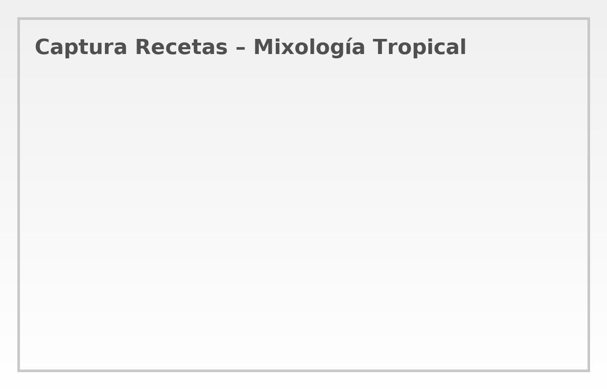
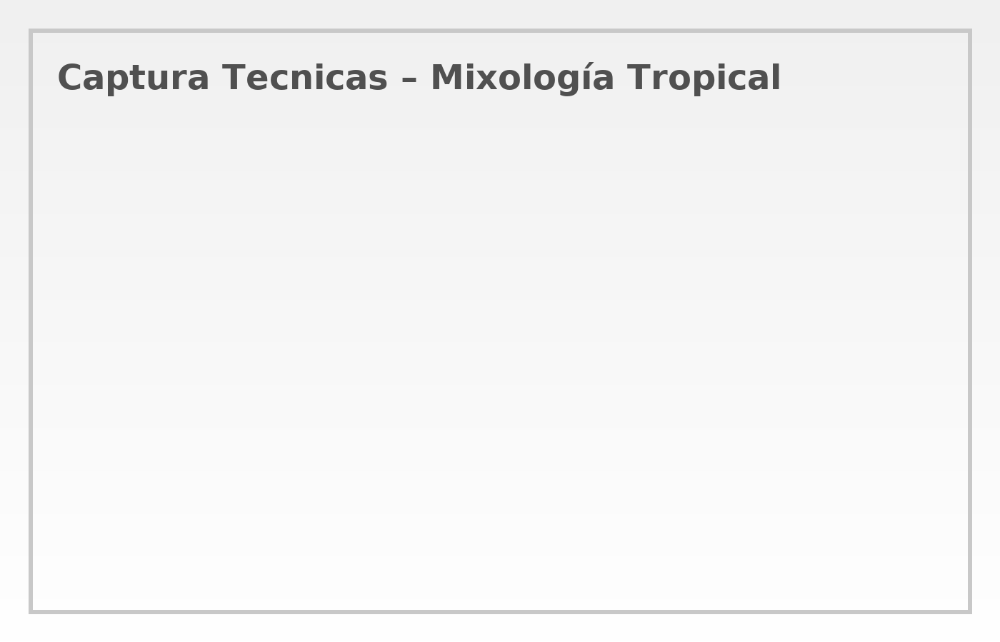

# 🌴🍸 Mixología Tropical Elegante

Una web de coctelería tropical con recetas, técnicas e imagen editorial minimalista.
Diseño **elegante tropical** tipo menú de coctelería fina.

## 🚀 Demo
👉 [Ver en GitHub Pages](https://73161334.github.io/Mixologia/)

## 📸 Capturas (PNG)

## 📂 Estructura
- `index.html`
- `style.css`
- `img/` (portada, recetas, técnicas, capturas)
- `videos/` (enlaces embebidos desde YouTube)

## 🧼 Tips
- Imágenes optimizadas para carga rápida en GitHub Pages.
- Texto con buen contraste sobre fotos.
- Diseño responsive y transiciones suaves.

Hecho con ❤️ por Carlos Mario.
